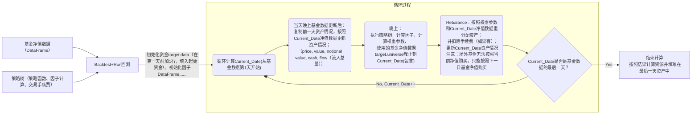
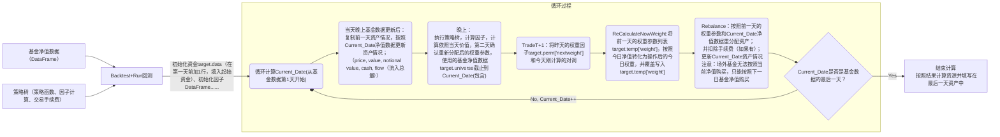

# DFFC Model
##  funddata_csv文件夹
    存放了一些基金的历史数据，所有的基金的历史数据有点大不放上来了。
##  fundpairtest文件夹
    使用Mathematica给出了一些基金对的检验。
##  fundSpider-master
    python的基金数据爬虫，来源是https://github.com/luricheng/fundSpider
##  DFFC_model_python
    python的策略和回测、优化框架。
    
1. 文件格式
	a. 基金历史净值数据（类型：fundinfo or dataframe）
		{{时间（几个交易日前，-1为前一天），当日净值（晚上更新的），当日日期},......}
	b. 持仓操作策略文件格式
		{{当日日期"YYYY-MM-DD"，时间（几个交易日前，负数），{{基金编号, 数量（Quantity）(资金/单价，正数为买入)}, {交易时的单价}, {手续费}},{{基金编号, 数量（Quantity）(资金/单价，正数为买入)}, {交易时的单价}, {手续费}}}}
	c. 我的资产(类型：class mymoney)
		总现金，基金1股数，基金2股数......
2. 程序
	a. 从操作策略文件+历史基金净值文件——历史资产状况文件

	b. 历史操作策略文件+历史资金净值文件——今天操作策略
	c. 历史基金净值文件1，2+模型函数文件——历史操作策略文件
	d. 参数优化系统

3. 程序流程图




```mermaid
flowchart TB
  subgraph 数据准备
    A[读取CSV数据] --> B[预处理数据]
    B --> C["计算指标（SMA、diff_ratio）"]
  end

  subgraph 策略定义
    D[创建Strategy对象] --> E["添加Algos:
      - RunDaily()
      - SelectAll()
      - WeighSMA()
      - Rebalance()"]
  end

  subgraph 回测执行
    F[初始化Backtest] --> G["设置初始资金、数据"]
    G --> H[开始日期循环]
    
    H --> I["当前日期 Current_Date"]
    I --> J["执行策略树"]
    
    subgraph 每日循环过程
      J --> K["RunDaily(): 触发每日执行"]
      K --> L["SelectAll(): 选择所有资产"]
      L --> M["WeighSMA():
        - 获取当前净值
        - 更新indicators
        - 计算权重"]
      M --> N["Rebalance():
        - 按权重调整持仓
        - 扣除手续费（若有）"]
    end
    
    N --> O{是否最后一天?}
    O -- 否 --> H
    O -- 是 --> P[生成回测结果]
  end

  subgraph 结果输出
    P --> Q["输出：
      - 收益曲线
      - 中间变量(indicators)
      - 绩效指标"]
  end

  style 数据准备 fill:#f9f,stroke:#333
  style 策略定义 fill:#ccf,stroke:#333
  style 回测执行 fill:#fcf,stroke:#333
  style 每日循环过程 fill:#cff,stroke:#333
  ```