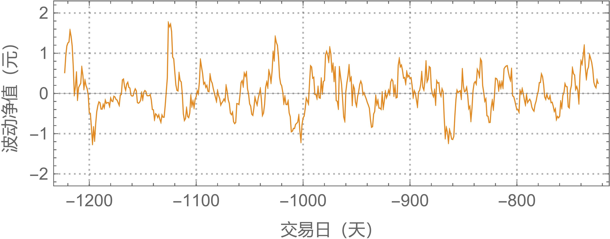
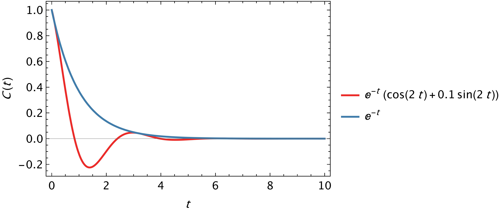
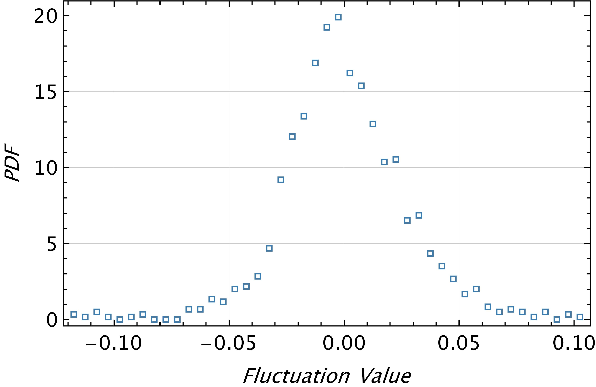
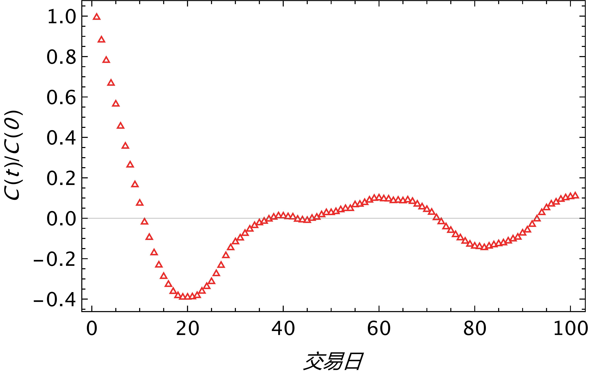
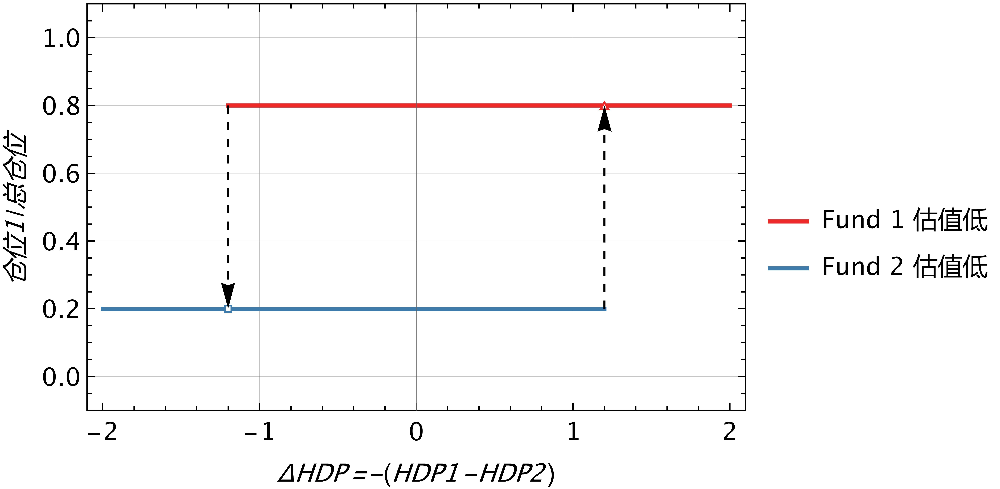
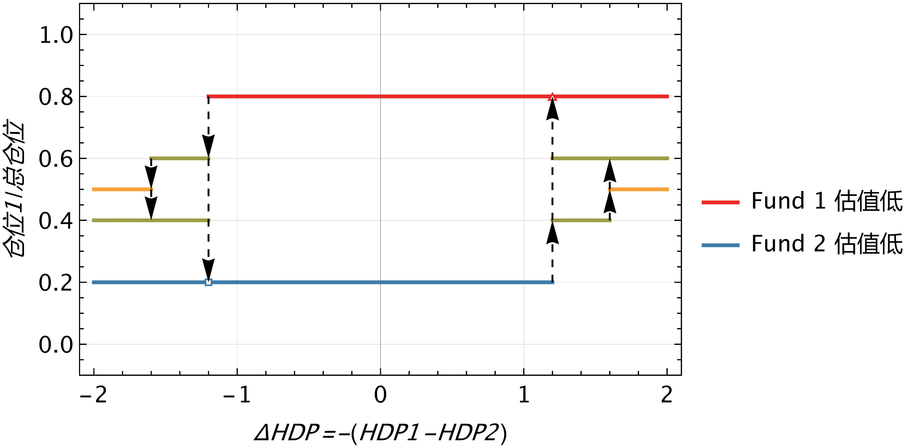
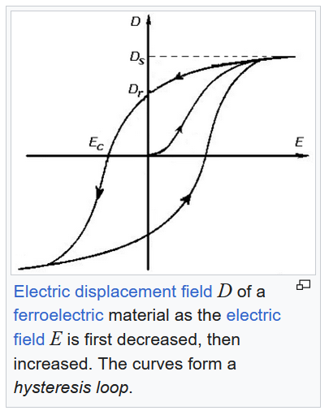

# DFFC-FOF-FundModel
---
## 1. 基本思路
### A. 盈利思路

如下图所示，这是某一只基金的净值-交易日曲线。我们发现，在-600天到0天，基金净值有上涨趋势，我们在-600天买入，当前天（0日）卖出，就能赚到绿线（50日均线）所示的长期收益。

另外，我们发现实际的单位净值数据，是在绿线上下波动的，如果我们能在净值位于均线下方时买入，上方时卖出；再再下一次均线位于下方时买入，上方时卖出，我们就能多赚取净值在绿线附近涨落的收益。

因此我们将我们的模型希望赚得的收益分为两部分：
- 长线收益
- 涨落收益（超额收益）

长线收益可以靠基金的历史数据分析、行情分析、选择基金等等提高；涨落收益则需要我们可以正确判断估值线（绿线），制定最优策略，在低估时做多、高估时做空赚取。假设策略指定得当，这部分可以在牛市多赚、熊市少亏。

除此以外，长线收益和短线收益需要定量方法协同工作：例如，基金长线上涨趋势明显，则过多的操作则不利于我们盈利，资金尽量多的留在基金里才是最好的；基金下跌趋势明显，则更需要我们多操作，来捕捉到更多的涨落收益，弥补长线收益的亏损，甚至赚钱。

### B. 基金池和FOF（Fund of Fund）
选择多个基金（同一基金公司可以加快调仓+减少手续费）构成基金池，可以降低风险，并且增加捕捉到超额收益的可能，并且可以解决很多问题。简单来看，我们先来看基金配对的好处。
#### a. 涨落不相关基金
两个（or多个）涨落不相关基金，可以协同工作，捕捉到更多长线收益和超额收益。

例如，下图中，我们操作单一基金，在涨落低点买入，在涨落高点卖出，红点表示持仓时间，灰线表示盈利。我们发现，在中间未持仓的时间，由于涨落部分在下跌，我们不持仓，不仅没有涨落收益，也损失了平均上涨的长线收益。若是长线收益的斜率再大一些，可能利润甚至没有中间不买入买出多！

因此，选择两支都在上涨，但涨落不相关的基金。通过在两只基金中间调仓，我们就可以避免手中持有现金没有投资的场景。
可以始终收获两只基金的长线收益，并且可能捕捉到更多的涨落收益，如下图所示。

这里我们选择了两支长线收益相等的两支基金的例子，事实上，两只基金的长线收益不等是经常发生的，这时候，我们就要在“尽可能多的把资金放在长线收益大的基金上”和“调入位于涨落低点，但是长线收益小的基金”中间权衡。
有时候，当涨落低点足够低的时候，调入长线收益小于0的基金，甚至也可以增加我们的收益率。

**因此，我们要选择涨落不相关，但是波动大的基金加入基金池**：
- 基金在长线上涨时，资金不留在手上
- 更多捕捉涨落超额收益的机会，甚至平均下跌的基金也可以捕捉
- 分散资金，降低风险

#### b. 涨落相关基金
有时候，我们会发现同一基金公司的几只基金，尽管看起来名字不一样，覆盖领域也不尽相同，但是却涨落高度相关。

例如，富国基金公司的以下两只基金：

计算其在五十日均线附近的涨落，乘以倍数，我们发现其涨落高度及接近，这时便可对于这两只基金实现统计套利。

##### 波差统计套利
参考DeepSeek.

#### c. 总结 

**总而言之，我们可以通过同一基金公司所有波动较大的基金，相关的基金分组实现统计套利，各组之间用不相关方法调仓，构成一只基金！**

这就是FOF（Fund of Fund）的思路，如今的FOF基金有如下劣势，但可以被我们的策略改善
- 强化分散投资，趋向平均收益，只能当成固定收益类产品
- 强调选基，缺少进攻性和超额收益捕捉
- 二次运作，手续费、运作成本高

---

## 2. 净值的拆分和模型化
通过我们的收益拆分，很自然的将净值拆分为了两部分：

$
f_i=g_i+\zeta _i
$

$g_i$ 是估值线代表的净值的长线部分，$\zeta _i$ 是在估值线附近的涨落部分。

这一部分我们将给出算法拆分实际基金数据，并对涨落部分建立随机模型。我们将其分为：

- 估值线的计算（净值的拆分）
- 模型化涨落净值

### A. 估值线模型和优化
估值线的本质是对某基金市场真实价值的判断，如果市场买入情绪高昂，则基金可能会高估，过后则会回调，真实净值是在估值线附近波动的（如紫线所示）。因此，估值线将是对净值数据的平滑。

需要说明的是，绿线所示的估值线使用50天窗口的滑动平均方法：例如，第-150天的绿线数据，使用了-175天至-125天的数据平均得到。而在-150当天，我们是无法预知-149至-125天的“未来”数据的，因此该绿线只作为说明问题的参考线，不能作为实际测量中的估值线。

**但是，我们可以将其作为我们预测估值线方法优化参数的目标函数。**

估值线的选择有很多方法，例如滑动平均+外推、指数滑动平均、卡尔曼滤波等等滤波平滑方法...这里我们选择了这几种方法。

#### a. Holt-winters二参数模型

Holt-Winters 双参数模型适用于具有**趋势成分**但**无季节性波动**的数据。它通过两个平滑参数（α 和 β）分别对序列的**水平**和**趋势**进行动态调整。

预测方程

$$
\hat{y}_{t+h} = L_t + h \cdot T_t
$$

水平方程+趋势方程

$$
L_t = \alpha y_t + (1 - \alpha)(L_{t-1} + T_{t-1})
$$

$$
T_t = \beta (L_t - L_{t-1}) + (1 - \beta) T_{t-1}
$$

- $\alpha$: 水平平滑参数（0 ≤ α ≤ 1）
- $\beta$: 趋势平滑参数（0 ≤ β ≤ 1）

#### b. Holt-Winters三参数+季节性模型

Holt-Winters 三参数模型适用于同时包含**趋势成分**和**季节性波动**的时间序列数据。通过三个平滑参数（α、β、γ）分别对**水平**、**趋势**和**季节性成分**进行动态调整，支持**加法**与**乘法**两种季节性模式。

**水平方程**

加法模型：  

$$
L_t = \alpha (y_t - S_{t-m}) + (1 - \alpha)(L_{t-1} + T_{t-1})
$$

乘法模型：  

$$
L_t = \alpha \frac{y_t}{S_{t-m}} + (1 - \alpha)(L_{t-1} + T_{t-1})
$$

**趋势方程**

$$
T_t = \beta (L_t - L_{t-1}) + (1 - \beta) T_{t-1}
$$

**季节性方程**
加法模型：  

$$
S_t = \gamma (y_t - L_t) + (1 - \gamma) S_{t-m}
$$

乘法模型：  

$$
S_t = \gamma \frac{y_t}{L_t} + (1 - \gamma) S_{t-m}
$$

**预测方程**
加法模型（季节性波动恒定）：  

$$
\hat{y}_{t+h} = (L_t + h \cdot T_t) + S_{t+h-m}
$$

乘法模型（季节性波动随水平变化）：  

$$
\hat{y}_{t+h} = (L_t + h \cdot T_t) \times S_{t+h-m}
$$

- $\alpha$（水平参数）：调节**当前观测值**与**历史平滑水平**的权重（0 ≤ α ≤ 1）  
- $\beta$（趋势参数）：控制**趋势变化的更新速度**（0 ≤ β ≤ 1）  
- $\gamma$（季节性参数）：平衡**当前季节性效应**与**历史季节性模式**（0 ≤ γ ≤ 1）  
- $m$ ：季节性周期长度（如月度数据 $ m=12 $ ，季度数据 $ m=4 $ ）

- **加法模型**：季节性波动的幅度**不随序列水平变化**（如气温季节性波动）  
- **乘法模型**：季节性波动的幅度**随序列水平增长而扩大**（如节假日销售额）  

- 需预先通过**时间序列分解**判断季节性类型（加法/乘法）  
- 参数优化复杂度高，建议使用**自动优化工具**（如 `statsmodels` 库）  
- 初始化需设定 $L_0$ , $T_0$ 和 $S_0$ ，可通过**移动平均法**或**分段拟合**确定

#### c. 参数优化
我们需要选择参数，使得上述模型对净值的反应不至于过于灵敏，以至于无法判断高估或者低估；又不能过于平滑，误判真实价值使得净值数据不能反复穿过估值线。

另外，由于我们的后续策略，需要的不是准确的估值线，而是准确的在估值线附近的涨落。例如，我们平滑后的模型估值线，可以比真实估值线灵敏一点，不需要重叠，但是需要真实数据在模型估值线附近的涨落模式，和在真实估值线附近的涨落模式一样。因此我们如下优化参数。

##### 目标函数

设 $data_i$ 为每日净值数据，$sma50_i$ 为基于历史记录计算得到的50日均线，$model_i(\alpha_i)$ 为模型滚动预测的估值线。

$$
RSS(\alpha_i)=\Sigma _i \left(\left(data_i-model_i(\alpha_i)\right)-a\cdot\left(data_i-sma50_i\right)\right)^2
$$

其中，通过$\frac{dRSS}{da}=0$可以计算得到最优缩放因子

$$
a=\frac{\Sigma_i\left( \left(data_i-model_i(\alpha_i)\right)\cdot\left(data_i-sma50_i\right)\right)}{\Sigma_i \left(data_i-sma50_i\right)^2}
$$

最优参数 $\alpha _i$ 使得残差RSS最小。

##### 优化方法
holtwinter_op.py中，待补充

##### 参数稳定性和过拟合验证
不同历史数据的稳定性；
交叉验证的稳定性；

### B.模型化涨落净值

自此，我们已经成功的把一只基金数据拆分成了长线部分（baseline part）和涨落部分（fluctuation part）。接下来，我们需要讨论基于这两部分的信息，我们如何制定投资策略，才能收益最大化，或者说

“**在风险确定的情况下，可以找到对应的最大收益**”——马科维茨

观察下面一个基金的涨落，我们发现以下几点是深刻影响我们的策略的。

- 长线部分的涨跌
- 涨落部分的涨落幅度
- 涨落部分的时间关联（波动是有惯性的，不是白噪声）
基于这三点，我们构建理论模型，希望可以理论推导最大收益/风险比

#### a. 随机模型——谐振势中的布朗运动模型

考虑一个一维线性恢复力下的布朗运动粒子，其受力方程为

$$
\ddot{x}=-\frac{\gamma}{m}\dot{x}-\omega _0^2 x+\frac{1}{m}\xi(t)
$$

其中，随机项 $\xi(t)$ 为高斯随机白噪声

$$
   \langle\xi(t)\rangle=0
$$

$$
   \langle\xi(t')\xi(t'+t)\rangle=2\gamma k_B T \delta(t)
$$

求解：对受力方程傅里叶变换，可以解得

$$
x(\omega)=\frac{\xi(\omega)}{m\left(\omega _0^2-\omega^2-i\gamma\omega/m\right)}
$$

能谱密度

$$
S(\omega)=|x(\omega)|^2=\frac{2 \gamma k_{\mathrm{B}} T}{m^2} \frac{1}{\left[\left(\omega_0^2-\omega^2\right)^2+\frac{\gamma^2}{m^2} \omega^2\right]}
$$

稳态情况下的时间关联函数为能谱密度的傅里叶变换

$$
\begin{aligned}
C(t)&=\frac{1}{2 \pi} \int_{-\infty}^{\infty} \mathrm{d} \omega \mathrm{e}^{-\mathrm{i} \omega t} S_x(\omega)\\
&=\frac{k_{\mathrm{B}} T}{m \omega_0^2} \mathrm{e}^{-\frac{\gamma}{2 m} t}\left\{\cos \omega_1 t+\frac{\gamma}{2 m \omega_1} \sin \omega_1 t\right\}
\end{aligned}
$$

其中，

$$
\omega_1=\sqrt{\omega_0^2-\gamma^2 / 4 m^2}
$$

#### b. Ornstein-Uhlenbeck Process
也有更简化，略去阻力的Ornstein-Uhlenbeck过程

$$
\dot{x}=-\theta x+\sigma \xi(t)
$$

$$
   \langle\xi(t)\rangle=0
$$

$$
   \langle\xi(t')\xi(t'+t)\rangle= \delta(t)
$$

使用一阶常系数非齐次微分方程通解，可以解得

$$
x(t)=\sigma\int^t_0 e^{-\theta\left(t-s\right)}\xi(s)ds
$$

计算时间关联可以得到

$$
\begin{aligned}
C(t_1,t_2)&=\langle x(t_1)x(t_2) \rangle _\xi\\
&=\sigma^2\langle \int^{t_1}_0 e^{-\theta\left(t_1-s_1\right)}\xi(s_1)ds_1\int^{t_2}_0 e^{-\theta\left(t_2-s_2\right)}\xi(s_2)ds_2\rangle\\
&=\sigma^2 e^{-\theta\left(t_1+t_2\right)} \langle \int^{t_2}_0\int^{t_1}_0 e^{\theta\left(s_1+s_2\right)}\xi(s_1)\xi(s_2)ds_1ds_2\rangle\\
&=\sigma^2 e^{-\theta\left(t_1+t_2\right)} \int^{t_2}_0\int^{t_1}_0 e^{\theta\left(s_1+s_2\right)}\langle \xi(s_1)\xi(s_2) \rangle ds_1ds_2\\
&=\sigma^2 e^{-\theta\left(t_1+t_2\right)} \int^{t_2}_0\int^{t_1}_0 e^{\theta\left(s_1+s_2\right)}\delta(s_1-s_2) ds_1ds_2\\
&=\sigma^2 e^{-\theta\left(t_1+t_2\right)} \int^{t_2}_0 e^{2\theta s_2}ds_2\\
&=\frac{\sigma^2}{2\theta} e^{-\theta |t_1-t_2|}
\end{aligned}
$$

为什么？知乎？统计套利的基石。

#### c. 真实数据的模型拟合

008299数据在50日均线上下的涨落数据

涨落数据的概率密度

涨落数据的时间关联

##### 分析
- 时间关联函数不是单纯的指数衰减，在20日左右包含小于0的回调部分，可能代表着最佳的操作周期，OU过程可能并不适合。
- 涨落数据接近均值为0的高斯分布
- 验证真实数据是二阶的，只包含当前值和动量：根据关联函数拟合随机模型参数之后，验证动量-模型项的关联函数，是否为白噪声
- 是否使用随机差分方程代替随机函数（随机过程），在生成数据&参数拟合上都更好？
- 观察涨落数据的差分的关联函数，发现涨落数据没有动量：动量只存在在均线当中，MACD的拆分
- 只捕捉到第二次到0的涨落关联，不捕捉多个峰值。

#### d. 差分格式的谐振子布朗运动

$$
\left\{
\begin{array}{ll}
\zeta _{i} - \zeta _{i-1}=\zeta' _{i-1}\\
\zeta' _{i}-\zeta' _{i-1} =-a \zeta' _{i-1} - b\zeta _{i} +c \xi_{i}\\
\langle\xi_i\rangle=0\\
\langle\xi_i\xi_j\rangle=\delta_{i,j}
\end{array}
\right.
$$

隐式&显式区别？

化简后递推公式为
$$
$$ 

自己想的一个关联函数求解方法，不知道对不对：
设递推公式为

$$
a f_{i+1}+bf_{i}+cf_{i-1}=\xi_{i}
$$

设整数格点时，$f(i)=f_i$，在第$i$项展开有

$$
f_{i+1}=f(i)+\partial_x f+\frac{1}{2}\partial_{xx}f+\frac{1}{6}\partial_{xxx}f+...
$$

$$
f_{i-1}=f(i)-\partial_x f+\frac{1}{2}\partial_{xx}f-\frac{1}{6}\partial_{xxx}f+...
$$

$$
\xi_i=\xi(i)
$$

对$x$进行傅里叶变换，有

$$
\begin{aligned}
F[f_{i+1}]&=\tilde{f}(k)\left(1+(ik)+\frac{1}{2}(ik)^2+\frac{1}{6}(ik)^3+...\right)\\
&=\tilde{f}(k) e^{ik}
\end{aligned}
$$

$$
\begin{aligned}
F[f_{i-1}]&=\tilde{f}(k)\left(1-(ik)+\frac{1}{2}(ik)^2-\frac{1}{6}(ik)^3+...\right)\\
&=\tilde{f}(k) e^{-ik}
\end{aligned}
$$

原方程化为

$$
\tilde{f}(k)=\frac{F[\xi_{i}]}{a e^{ik}+b+c e^{-ik}}
$$

谱密度函数为

$$
\begin{aligned}
S(k)&=|\tilde{f}(k)|^2\\
&=\frac{F[\xi_{i}]^2}{a e^{ik}+b+c e^{-ik}}\\
&=\frac{1}{a e^{ik}+b+c e^{-ik}}\\
\end{aligned}
$$

关联函数

$$
\begin{aligned}
C(x)&=\frac{1}{2\pi}\int^\infty_{-\infty} e^{-ikt}S(k)dk\\
&=
\end{aligned}
$$

--- 
## 3. 策略的制定和优化

依据模型拟合参数生成随机数据最优化
策略只能由（动量+涨落+参数（历史））决定

机器学习？

### 单只基金策略
#### 买入条件
- Holtwinters-Delta-Percentage小于-95%，且未持仓，全仓购入
- Holtwinters-Delta-Percentage上穿-80%，且未持仓，全仓购入
- 整体处于上涨趋势中？

#### 卖出条件
- Holtwinters-Delta-Percentage下穿50%，且持仓，全仓卖出
- 跟踪动态止损条件：相较于最高点回撤超过2%，且持仓全仓卖出
- 止损条件是买入时间的函数？在14天之后迅速下滑缩小？

### 多只基金策略

#### 价值基金组（80%）
债基组30%         （华夏磐泰LOF）
红利组20%         （中证红利低波动ETF、红利低波50ETF、中证银行ETF、鹏华香港银行指数）
纳斯达克10%       （华宝C）
黄金20%           （国泰黄金ETF联接E）

- 按照波动率的反比持仓分布
- 根据因子在其中调仓
- 组合内部使用波差统计套利

##### 策略思路
- 低吸高抛，网格策略的例子：没有记忆效应就无法得到收益。

    
    

- 记忆效应：水货小方块策略，问题——单层分仓，只做左侧交易。

    
    

- 右侧交易的实现：最高点的逼近。

    
    

- 多层分仓的实现：最高点的逼近。

    
    

- 无穷多分仓：磁滞回线策略。

    
    

##### 双基金策略 ：水货小方块策略
- 设置目标仓位：减小最大回撤，控制风险，按照波动率反比计算均衡时刻的目标仓位
   - 目标仓位计算逻辑：
      - 目标仓位的计算：target_i = target_i0 / (1 + HDP)，再归一化
      - 事件驱动调仓：如果当前持仓和目标仓位的差值很大，则需要相应减小调仓量？（追涨杀跌？）
      - 磁滞回线？用短期动量+位置判断调仓量，不加入动量判断就没用

- 固定周期调仓：固定周期保证流动性，逐渐靠拢目标，每次向目标仓位靠拢差值的百分数：adjust_factor = [0, 1]

###### 优化问题

- 只做左侧交易，可以左侧+右侧捕捉顶端/谷底
- 200%/-200%的两侧再保留小分仓，应对极端情况
- 没有对不同HDP分层交易，一锅端太简单。
- 事件驱动调仓：如果当前持仓和目标仓位的差值很大，则需要相应减小调仓量？（追涨杀跌？），每次只能升一个台阶？
- 长线止损逻辑：sma10小于sma300，长时间的趋势逐渐消失，而非突然消失？怎么比较？如果缓慢趋势消失标的糟糕，hdp不会变的很低的，有自然的平滑效果。
         如果发现长期趋势不对，则不再买入该标的，直到趋势恢复，而是只卖出。
- 事件驱动调仓：如果是长周期+大靠拢系数，加入事件驱动保证不会错过机会。

##### 多基金策略 ：仓位系数加权模型
- 设置HDP = 0%时目标仓位$T_{i0}$：减小最大回撤，按照波动率反比or目标收益率计算均衡时刻的目标仓位
- 根据HDP调整目标仓位计算逻辑：
   - 目标仓位的计算：$$T_i = \frac{T_{i0} \cdot \theta_i}{\Sigma_i \left( T_{i0} \cdot \theta_i\right)}$$
   - 其中$\theta_i$是仓位系数，是自己的$HDP_i$的，有记忆效应的函数，$\theta_i = (0,1)$且与HDP负相关。
   - 例如，使用水货小方块策略。

- 固定周期调仓：逐渐靠拢目标仓位，每次向目标仓位靠拢差值的百分数：$$adjust\_factor = [0, 1]$$
   - 靠拢算法：假设目标仓位是$T_i$，原始仓位是$R_i$，调整后的仓位$$S_i=R_i+adjust\_factor\cdot(T_i-R_i)$$通过两个元素的操作将$R_i$调整为$S_i$，且保证总调仓量最小。
   设：$\Delta R_i = R_i+adjust\_factor\cdot(T_i-R_i)$，每次找到最小的两个反号的非零调仓绝对值$\Delta R_{m,n}=min\{\Delta R_i\}$，调仓使得最小的为0，并记录调仓方法。最后将所有调仓按照调仓量绝对值从大到小排序即可。

- 事件驱动调仓：事件驱动保证不会错过机会

###### 优化问题
- 单个标的的仓位上限，避免极端情况出现和极度押宝
- 每个标的的磁滞回线优化问题。
- 使用磁滞回线计算双基金对冲的结果没有双基金配对的结果好，或许没有用差配置磁滞回线好？还是没有对每个基金优化？
- 如果使用配对分布矩阵处理多基金呢？

##### 多基金策略 ：配对矩阵模型
- 至少包含双基金策略，可以处理有些基金无法转换调仓的问题。

#### 进攻基金组（20%）
- 根据波动率计算价格，按照订单进攻
- 尽量做到涨落不相关
- 单笔订单根据波动率计算止损最大回撤条件