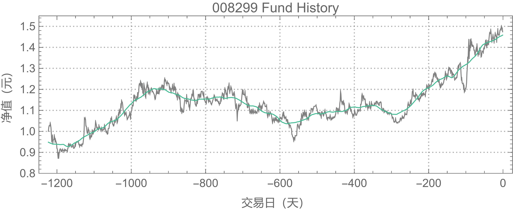
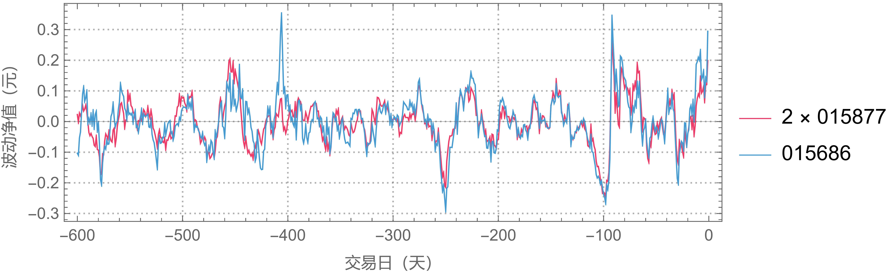

# DFFC-FoF-FundModel
---
## 基本思路
### 1. 盈利思路

如下图所示，这是某一只基金的净值-交易日曲线。我们发现，在-600天到0天，基金净值有上涨趋势，我们在-600天买入，当前天（0日）卖出，就能赚到绿线（50日均线）所示的长期收益。

另外，我们发现实际的单位净值数据，是在绿线上下波动的，如果我们能在净值位于均线下方时买入，上方时卖出；再再下一次均线位于下方时买入，上方时卖出，我们就能多赚取净值在绿线附近涨落的收益。

因此我们将我们的模型希望赚得的收益分为两部分：
- 长线收益
- 涨落收益（超额收益）

长线收益可以靠基金的历史数据分析、行情分析、选择基金等等提高；涨落收益则需要我们可以正确判断估值线（绿线），制定最优策略，在低估时做多、高估时做空赚取。假设策略指定得当，这部分可以在牛市多赚、熊市少亏。

除此以外，长线收益和短线收益需要定量方法协同工作：例如，基金长线上涨趋势明显，则过多的操作则不利于我们盈利，资金尽量多的留在基金里才是最好的；基金下跌趋势明显，则更需要我们多操作，来捕捉到更多的涨落收益，弥补长线收益的亏损，甚至赚钱。

### 2. 基金池和FOF（Fund of Fund）
选择多个基金（同一基金公司可以加快调仓+减少手续费）构成基金池，可以降低风险，并且增加捕捉到超额收益的可能，并且可以解决很多问题。简单来看，我们先来看基金配对的好处。
#### 涨落不相关基金
两个（or多个）涨落不相关基金，可以协同工作，捕捉到更多长线收益和超额收益。

例如，下图中，我们操作单一基金，在涨落低点买入，在涨落高点卖出，红点表示持仓时间，灰线表示盈利。我们发现，在中间未持仓的时间，由于涨落部分在下跌，我们不持仓，不仅没有涨落收益，也损失了平均上涨的长线收益。若是长线收益的斜率再大一些，可能利润甚至没有中间不买入买出多！

因此，选择两支都在上涨，但涨落不相关的基金。通过在两只基金中间调仓，我们就可以避免手中持有现金没有投资的场景。
可以始终收获两只基金的长线收益，并且可能捕捉到更多的涨落收益，如下图所示。

这里我们选择了两支长线收益相等的两支基金的例子，事实上，两只基金的长线收益不等是经常发生的，这时候，我们就要在“尽可能多的把资金放在长线收益大的基金上”和“调入位于涨落低点，但是长线收益小的基金”中间权衡。
有时候，当涨落低点足够低的时候，调入长线收益小于0的基金，甚至也可以增加我们的收益率。

**因此，我们要选择涨落不相关，但是波动大的基金加入基金池**：
- 基金在长线上涨时，资金不留在手上
- 更多捕捉涨落超额收益的机会，甚至平均下跌的基金也可以捕捉
- 分散资金，降低风险

#### 涨落相关基金
有时候，我们会发现同一基金公司的几只基金，尽管看起来名字不一样，覆盖领域也不尽相同，但是却涨落高度相关。

例如，富国基金公司的以下两只基金：

计算其在五十日均线附近的涨落，乘以倍数，我们发现其涨落高度及接近，这时便可对于这两只基金实现统计套利。

##### 统计套利
参考DeepSeek.

#### 总而言之，我们可以通过同一基金公司所有波动较大的基金，相关的基金分组实现统计套利，各组之间用不相关方法调仓，构成一只基金！

这就是FOF（Fund of Fund）的思路，如今的FOF基金有如下劣势，但可以被我们的策略改善
- 强化分散投资，趋向平均收益，只能当成固定收益类产品
- 强调选基，缺少进攻性和超额收益捕捉
- 二次运作，手续费、运作成本高

---

## 涨落收益
这一部分我们计算如何设置模型指定策略收获涨落收益。我们将其分为两部分：
- 估值线的计算
- 策略捕捉在估值线附近涨落，获得最优收益。

### 估值线模型和优化
估值线的本质是对某基金市场真实价值的判断，如果市场买入情绪高昂，则基金可能会高估，过后则会回调，真实净值是在估值线附近波动的（如紫线所示）。因此，估值线将是对净值数据的平滑。

需要说明的是，绿线所示的估值线使用50天窗口的滑动平均方法：例如，第-150天的绿线数据，使用了-175天至-125天的数据平均得到。而在-150当天，我们是无法预知-149至-125天的“未来”数据的，因此该绿线只作为说明问题的参考线，不能作为实际测量中的估值线。

**但是，我们可以将其作为我们预测估值线方法优化参数的目标函数。**

估值线的选择有很多方法，例如滑动平均+外推、指数滑动平均、卡尔曼滤波等等滤波平滑方法...这里我们选择了这几种方法。

#### Holt-winters二参数模型

Holt-Winters 双参数模型适用于具有**趋势成分**但**无季节性波动**的数据。它通过两个平滑参数（α 和 β）分别对序列的**水平**和**趋势**进行动态调整。

预测方程

\[
\hat{y}_{t+h} = L_t + h \cdot T_t
\]

水平方程+趋势方程

\[
L_t = \alpha y_t + (1 - \alpha)(L_{t-1} + T_{t-1})
\]

\[
T_t = \beta (L_t - L_{t-1}) + (1 - \beta) T_{t-1}
\]

- \( \alpha \): 水平平滑参数（0 ≤ α ≤ 1）
- \( \beta \): 趋势平滑参数（0 ≤ β ≤ 1）

#### Holt-Winters三参数+季节性模型

Holt-Winters 三参数模型适用于同时包含**趋势成分**和**季节性波动**的时间序列数据。通过三个平滑参数（α、β、γ）分别对**水平**、**趋势**和**季节性成分**进行动态调整，支持**加法**与**乘法**两种季节性模式。

#### 1. 水平方程
**加法模型**：  

\[
L_t = \alpha (y_t - S_{t-m}) + (1 - \alpha)(L_{t-1} + T_{t-1})
\]  

**乘法模型**：  

\[
L_t = \alpha \frac{y_t}{S_{t-m}} + (1 - \alpha)(L_{t-1} + T_{t-1})
\]

#### 2. 趋势方程

\[
T_t = \beta (L_t - L_{t-1}) + (1 - \beta) T_{t-1}
\]

#### 3. 季节性方程
**加法模型**：  

\[
S_t = \gamma (y_t - L_t) + (1 - \gamma) S_{t-m}
\]  

**乘法模型**：  

\[
S_t = \gamma \frac{y_t}{L_t} + (1 - \gamma) S_{t-m}
\]

#### 4. 预测方程
**加法模型**（季节性波动恒定）：  

\[
\hat{y}_{t+h} = (L_t + h \cdot T_t) + S_{t+h-m}
\]  

**乘法模型**（季节性波动随水平变化）：  

\[
\hat{y}_{t+h} = (L_t + h \cdot T_t) \times S_{t+h-m}
\]

### 参数说明

- \( \alpha \)（水平参数）：调节**当前观测值**与**历史平滑水平**的权重（0 ≤ α ≤ 1）  
- \( \beta \)（趋势参数）：控制**趋势变化的更新速度**（0 ≤ β ≤ 1）  
- \( \gamma \)（季节性参数）：平衡**当前季节性效应**与**历史季节性模式**（0 ≤ γ ≤ 1）  
- \( m \)：季节性周期长度（如月度数据 \( m=12 \)，季度数据 \( m=4 \)）

---

### 适用场景
- **加法模型**：季节性波动的幅度**不随序列水平变化**（如气温季节性波动）  
- **乘法模型**：季节性波动的幅度**随序列水平增长而扩大**（如节假日销售额）  

---

### 注意事项
- 需预先通过**时间序列分解**判断季节性类型（加法/乘法）  
- 参数优化复杂度高，建议使用**自动优化工具**（如 `statsmodels` 库）  
- 初始化需设定 \( L_0 \)、\( T_0 \) 和 \( S_0 \)，可通过**移动平均法**或**分段拟合**确定

#### 参数优化
我们需要选择参数，使得上述模型对净值的反应不至于过于灵敏，以至于无法判断高估或者低估；又不能过于平滑，误判真实价值使得净值数据不能反复穿过估值线。

另外，由于我们的后续策略，需要的不是准确的估值线，而是准确的在估值线附近的涨落。例如，我们平滑后的模型估值线，可以比真实估值线灵敏一点，不需要重叠，但是需要真实数据在模型估值线附近的涨落模式，和在真实估值线附近的涨落模式一样。因此我们如下优化参数。

##### 目标函数
设$data_i$为每日净值数据，$sma50_i$为基于历史记录计算得到的50日均线，$model_i(\alpha_i)$为模型滚动预测的估值线。

$$
RSS(\alpha_i)=\Sigma _i \left(\left(data_i-model_i(\alpha_i)\right)-a\cdot\left(data_i-sma50_i\right)\right)^2
$$

其中，通过$\frac{dRSS}{da}=0$可以计算得到最优缩放因子

$$
a=\frac{\Sigma_i\left( \left(data_i-model_i(\alpha_i)\right)\cdot\left(data_i-sma50_i\right)\right)}{\Sigma_i \left(data_i-sma50_i\right)^2}
$$

最优参数$\alpha_i$使得残差RSS最小。

##### 优化方法
holtwinter_op.py中，待补充

##### 参数稳定性和过拟合验证
不同历史数据的稳定性；
交叉验证的稳定性；

### 涨落收益策略
#### 随机模型
- 维纳过程
- 谐振势中的布朗运动模型
