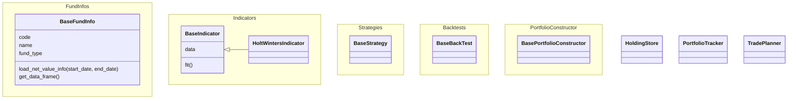

# Code Structure

```mermaid
classDiagram
    namespace FundInfos {
        class BaseFundInfo {
            code
            name
            fund_type
            load_net_value_info(start_date, end_date)
            get_data_frame()
        }
    }

    namespace Indicators {
        class BaseIndicator {
            data
            fit()
        }
        class HoltWintersIndicator
    }
    BaseIndicator <|-- HoltWintersIndicator

    namespace Strategies {
        class BaseStrategy
    }

    namespace Backtests {
        class BaseBackTest
    }

    class HoldingStore

    class PortfolioTracker

    class TradePlanner

    namespace PortfolioConstructor {
        class BasePortfolioConstructor
    }
```